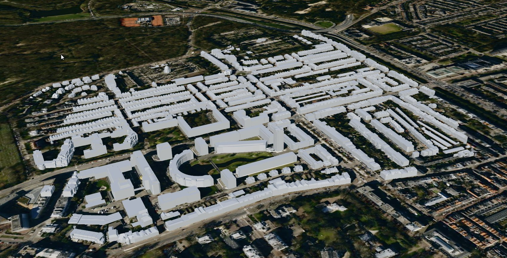
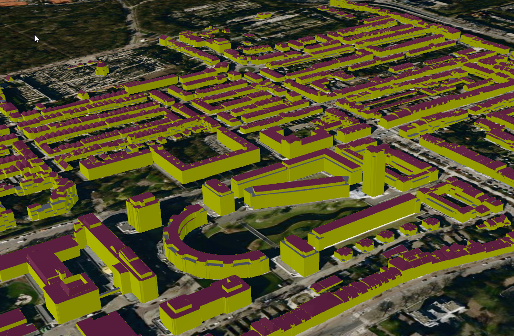

# Converting CityGML to 3D Tiles using 3DCityDB v5

## Overview

3DCityDB v5 is an open-source database designed for storing and managing semantic 3D city models based on the CityGML 3.0 standard. It runs on PostgreSQL with PostGIS and organizes city data into about 17 core tables that handle geometry, metadata, appearances, and relationships.  
This guide outlines how to install 3DCityDB v5, import CityGML data, export it as 3D Tiles, and visualize the results.

Note: In future iterations, 3DCityDB aims to improve support for creating 3D Tiles using pg2b3dm.

---

## 1. Installation  

3DCityDB v5 can be quickly deployed using Docker:

```bash
docker run -d -p 5440:5432 -it -e POSTGRES_PASSWORD=postgres -e PROJ_NETWORK=ON -e SRID=7415 3dcitydb/3dcitydb-pg
```

**Explanation:**
- `-p 5440:5432` — maps host port to container port  
- `POSTGRES_PASSWORD` — sets the database password  
- `PROJ_NETWORK=ON` — enables coordinate transformation downloads  
- `SRID=7415` — specifies the coordinate reference system (composite projection Amersfoort / RD New with NAP reference)  

After launching, the database schema is automatically created with tables for city objects, geometry data, attributes, and appearances.

---

## 2. Importing CityGML Data

Download a sample CityGML file, such as the Den Haag Archipelbuurt 3D model (45MB) from [https://ckan.dataplatform.nl/dataset/3d-stadsmodel-den-haag-2021-citygml/resource/be8d3a16-50f3-415f-a8bd-55d24c9d8cdc](https://ckan.dataplatform.nl/dataset/3d-stadsmodel-den-haag-2021-citygml/resource/be8d3a16-50f3-415f-a8bd-55d24c9d8cdc).

Example command for importing a CityGML file:

```bash
citydb import citygml -H localhost -d postgres -u postgres -p postgres --db-port 5440 den_haag_3d_archipelbuurt.gml
```

Create spatial index:

```sql
CREATE INDEX ON citydb.geometry_data USING gist(st_centroid(st_envelope(geometry)))
```

**Notes:**
- The importer loads buildings and other features into the schema.  
- Geometries are stored as `ST_PolyhedralSurface` or `ST_MultiPolygon` in the `geometry_data` table.  
- Attribute data such as building functions and IDs are stored in related tables.  

---

## 3. Converting to 3D Tiles  

Once the data is imported, it can be converted into 3D Tiles for visualization using the `pg2b3dm` tool:

```bash
pg2b3dm -U postgres -h localhost -l -p 5440 -d postgres -t citydb.geometry_data -c geometry --attributecolumns geometry_properties
```

**Result:**
- A `tileset.json` file describing the dataset’s structure and bounding volumes  
- Multiple subtree files defining hierarchical levels of detail  
- Binary glTF 2.0 (.glb) tiles ready for streaming  

---

## 4. Visualization  

The resulting 3D Tiles can be viewed in any Cesium-compatible viewer.  
When loaded, the 3D model displays buildings and terrain data with geometric accuracy and semantic detail.  
Optional styling can be added to control building colors, materials, or feature visibility.




---

## 5. Advanced visualization with shaders


To enhance the visual appearance of the 3D Tiles, we can apply shaders when generating the tiles. For example, use different
colors per CityGML class (like RoofSurface, WallSurface, OuterfloorSurface).

See [materials_for_features.csv](materials_for_features.csv) for an example mapping of CityGML feature classes to material colors.

Import the materials mapping into the database:

```sql
CREATE TABLE citydb.materials_for_features (
    namespace_of_classname TEXT,
    classname TEXT,
    namespace_of_property TEXT,
    property_name TEXT,
    column_name_of_property_value TEXT,
    property_value TEXT,
    pbr_metallic_roughness_base_color TEXT,
    pbr_metallic_roughness_metallic_roughness TEXT
);

\copy materials_for_features FROM 'materials_for_features.csv' WITH (FORMAT csv, HEADER true);
```

Create a view containing the geometry data along with the corresponding material colors:

```sql
CREATE OR REPLACE VIEW citydb.geoms4tiles
AS 
WITH material_data_cte AS (
    SELECT
        mtf.namespace_of_classname,
        mtf.classname,
        JSON_OBJECT(
            'PbrMetallicRoughness' : JSON_OBJECT(
                'BaseColors' :
                    NULLIF(
                        ARRAY[mtf.pbr_metallic_roughness_base_color],
                        '{NULL}'::text[]
                    ),
                'MetallicRoughness' :
                    NULLIF(
                        ARRAY[mtf.pbr_metallic_roughness_metallic_roughness],
                        '{NULL}'::text[]
                    )
                ABSENT ON NULL
                RETURNING json
            )
            ABSENT ON NULL
            RETURNING json
        ) AS material_data
    FROM materials_for_features mtf
    WHERE mtf.property_value IS NULL
)
SELECT 
    ftr.objectid,
    obcl.classname,
    pbr.material_data,
    geometry AS geom
FROM geometry_data gmdt
    LEFT JOIN feature ftr ON ftr.id = gmdt.feature_id
    LEFT JOIN objectclass obcl ON obcl.id = ftr.objectclass_id
    LEFT JOIN namespace ns ON ns.id = obcl.namespace_id
    LEFT JOIN material_data_cte pbr ON pbr.namespace_of_classname = ns.alias AND pbr.classname = obcl.classname
	where ftr.objectid NOT LIKE 'bag%';    
```

Note: The view filters out building parts from the Dutch BAG dataset (ftr.objectid NOT LIKE 'bag%') to avoid visual clutter.

Now, generate the 3D Tiles using the new view:

```bash
pg2b3dm -U postgres -h localhost l -p 5440 -d postgres -t citydb.geoms4tiles -c geom --shaderscolumn material_data -a objectid,classname --default_alpha_mode BLEND
```

Result: The exported 3D Tiles will now have different colors based on the CityGML feature classes, enhancing the visualization quality.



---

## 5. Conclusion  

3DCityDB v5 streamlines the process of:
- Storing and querying CityGML 3.0 models in PostgreSQL/PostGIS  
- Converting them into web-ready 3D Tiles for efficient visualization  
- Supporting semantic 3D city models suitable for digital twin and urban planning applications  

Future improvements may include the direct handling of texture data to enrich the visual quality of the exported 3D Tiles.
