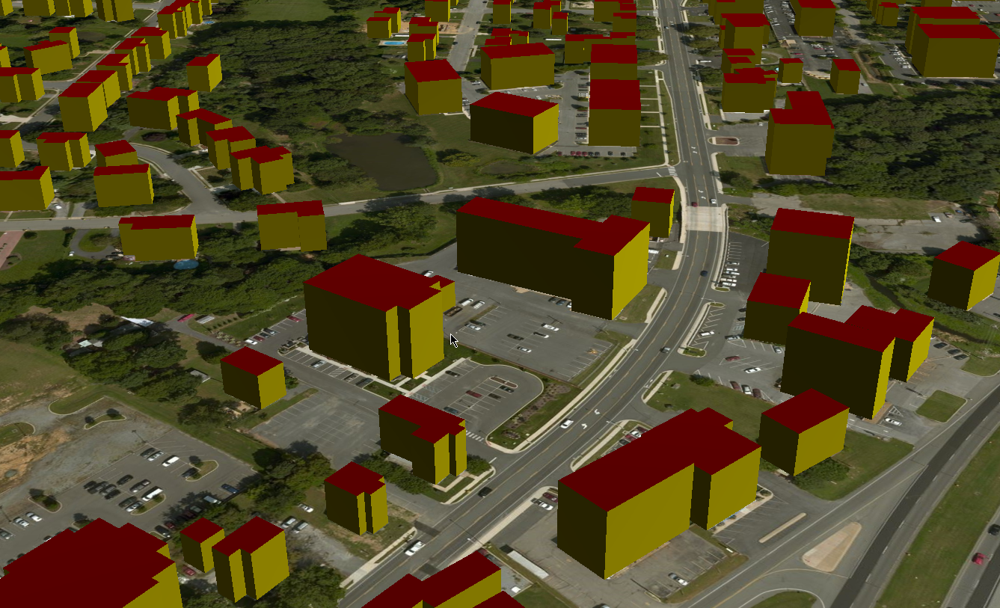

# Getting started

## Introduction

In this document we run pg2b3dm on a sample dataset, a shapefile from Delaware containing building footprints with a height attribute. 
The generated 3D tiles are visualized in a CesiumJS/Cesium for Unreal viewer.

** Note: For MapBox GL JS support use an older version of the document and version pg2b3dm < 1.0. **

## Download data

We download a dataset from the US Building Footprints.

https://wiki.openstreetmap.org/wiki/Microsoft_Building_Footprint_Data

Download dataset: 

Delaware - Dover (22,532 buildings available)

https://1drv.ms/u/s!AqWv0F0N63JkgQqO6E9e2kI28R16

Donwload zip, unzip. It contains a 'bldg_footprints.shp' shapefile with building height column.

## Prerequisites

- PostGIS database

- .NET 6.0 SDK https://dotnet.microsoft.com/download/dotnet/6.0

- GDAL (ogr2ogr)

## Import buildings to PostGIS

Import the buildings to database using ogr2ogr.

```
$ ogr2ogr -f "PostgreSQL" PG:"host=localhost user=postgres password=postgres dbname=postgres" bldg_footprints.shp -nlt POLYGON -nln delaware_buildings
```

In PostGIS, a spatial table 'delaware_buildings' is created.

## Add columns 

```
postgres=# ALTER TABLE delaware_buildings ADD COLUMN  geom_triangle geometry;
postgres=# ALTER TABLE delaware_buildings ADD COLUMN style json;
postgres=# ALTER TABLE delaware_buildings ADD COLUMN shaders json;
```

## Shaders

Update the style column with a JSON file containing walls, roof, floor colors:

Colors used:

#008000: green (floor)

#FF0000: red (roof)

#EEC900: yellow (wall)

```
postgres=# UPDATE delaware_buildings SET style = ('{ "walls": "#EEC900", "roof":"#FF0000", "floor":"#008000"}');
```
The 'shaders' column will be filled in next 'bertt/tesselate_building' step.

## Run tesselate_building

Install tool tesselate_building

```
$ dotnet tool install --global tesselate_building
```

When installation gives problems try with:

```
$ dotnet tool install -g --add-source 'https://api.nuget.org/v3/index.json' --ignore-failed-sources tesselate_building
```

Tool tesselate_building does the following:

- reads the footprint heights and geometries (from wkb_geometry);

- extrudes the buildings with height value; 

- triangulate the building and gets the colors per triangle;

- writes geometries to column geom_triangle (as polyhedralsurface geometries);

- writes shaders info (color code per triangle) into shaders column;
```
$ tesselate_building -h localhost -U postgres -d postgres -f cesium -t delaware_buildings -i wkb_geometry -o geom_triangle --idcolumn ogc_fid --stylecolumn style --shaderscolumn shaders
Tool: Tesselate buildings 0.2.0.0
Password for user postgres:
Progress: 100.00%
Elapsed: 74 seconds
Program finished.
```

After running, columns 'geom_triangle' and 'shaders' should be filled with the correct information.

The geom_triangle column contains PolyhedralSurfaceZ geometries consisting of triangles.

The shaders column contains json information like:

```
{
  "PbrMetallicRoughness": {
    "BaseColors": [
      "#008000",
      "#008000",
      "#FF0000",
      "#FF0000",
      "#EEC900",
      "#EEC900",
      "#EEC900",
      "#EEC900",
      "#EEC900",
      "#EEC900",
      "#EEC900",
      "#EEC900"
    ]
  }
}
```

In this case PbrMetallicRoughness shader will be used, for all the triangles there is a color code.

## Run pg2b3dm

Install pg2b3dm:

```
$ dotnet tool install --global pg2b3dm
```

Run pg2b3dm, the program will make a connection to the database and 1 tileset.json and 927 b3dm's will be created in the output directory.

```
$ pg2b3dm -h localhost -U postgres -c geom_triangle -t delaware_buildings -d postgres -a ogc_fid,height --shaderscolumn shaders
Tool: pg2b3dm 1.5.5.0
Password for user postgres:
Start processing 2023-02-13T15:06:32....
Input table: delaware_buildings
Input geometry column: geom_triangle
Lod column:
Geometric errors: 2000,0
Geometric error used for implicit tiling: 2000
Spatial reference of delaware_buildings.geom_triangle: 4978
Query bounding box of delaware_buildings.geom_triangle...
Bounding box for delaware_buildings.geom_triangle (in WGS84): -75.6145, 39.0771, -75.4353, 39.2319
Heights for bounding volume: [0 m, 100 m]
Translation: 1237929.375,-4795306,4005629.75
Use 3D Tiles 1.1 implicit tiling: True
Attribute columns: id,height
Maximum features per tile: 1000
Start generating tiles...
Creating tile: 3_5_5.b3dm
Tiles created: 59
Writing 29 subtree files...
Available Levels: 5
Subtree Levels: 3
SubdivisionScheme: QUADTREE
Writing output/tileset.json...

Elapsed: 12 seconds
Program finished 2023-02-13T15:06:45.
```

## Visualize in CesiumJS

Copy the generated tiles to sample_data\delaware\cesium\ (overwrite the tileset.json and sample tiles in tiles directory there).

Put folder 'sample_data' on a webserver (for example $ python3 -m http.server) and navigate to /delaware/cesium/index.html

If all goes well in Delaware - Dover you can find some 3D Tiles buildings.



Sample live demo in Cesium: https://geodan.github.io/pg2b3dm/sample_data/delaware/cesium/

## Visualize in Cesium for Unreal

Required: 

- Installation Unreal Engine with plugin 'Cesium for Unreal' - version 1.15.1 and above


- Use -f cesium in previous step tesselate_building.

Copy the generated tiles to webserver (for example $ python3 -m http.server)

- In Unreal create a new blank project

- In Unreal press '+' next to 'Blank 3D Tiles Tileset' in the Cesium panel


- In the Outliner - Cesium3DTileset properties change property Source from  'From Cesium Ion' to 'From Url'

- In the Outliner - Cesium3DTileset properties change property Url from  to the url (inclusing tileset.json - for example http://localhost:8000/tileset.json)


- Double click left mouse button on Item 'Cesium3DTileset' to zoom to the 3D Tiles.

- Disable Outliner - Lighting - ExponentialHeight Fog


- Change camera speed for better navigation (using right mouse click - wasd keys)

. Camera speed to 8 

. Camera speed scalar to 2


- Deselect buildings by click in the view 

If all goes well the 3D Tiles the 3D Tile buildings should be visualized.


