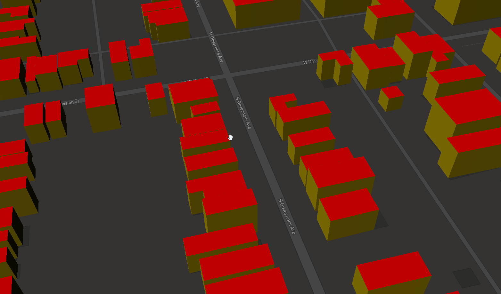

# Getting started

## Introduction

In this document we run pg2b3dm on a sample dataset, a shapefile from Delaware containing building footprints with a height attribute. 
The generated 3D tiles are visualized in a Cesium and MapBox viewer.

## Download data

We download a dataset from the US Building Footprints.

https://wiki.openstreetmap.org/wiki/Microsoft_Building_Footprint_Data

Download dataset: 

Delaware - Dover (22,532 buildings available)

https://1drv.ms/u/s!AqWv0F0N63JkgQqO6E9e2kI28R16

Donwload zip, unzip. It contains a 'bldg_footprints.shp' shapefile with building height column.

## Prerequisites

- PostGIS database

- .NET 6.0 SDK https://dotnet.microsoft.com/download/dotnet/6.0

- GDAL (ogr2ogr)

## Import buildings to PostGIS

Import the buildings to database using ogr2ogr.

```
$ ogr2ogr -f "PostgreSQL" PG:"host=localhost user=postgres password=postgres dbname=postgres" bldg_footprints.shp -nlt POLYGON -nln delaware_buildings
```

In PostGIS, a spatial table 'delaware_buildings' is created.

## PSQL into PostGIS

PSQL into PostGIS and do a count on the buildings:

```
postgres=# select count(*) from delaware_buildings;
 count
--------
 22532
(1 row)
```

## Clean data

Maybe there are some invalid polygons, let's remove them first.

```
postgres=# DELETE from delaware_buildings where ST_IsValid(wkb_geometry)=false;
DELETE 0
```

## Add id field with text type

```
postgres=# ALTER TABLE delaware_buildings ADD COLUMN id varchar;
postgres=# UPDATE delaware_buildings SET id = ogc_fid::text;
```

## Add column for output triangulated geometry

```
postgres=# ALTER TABLE delaware_buildings ADD COLUMN  geom_triangle geometry;
```

## Shaders

Add two json columns to the delaware_buildings table:

```
postgres=# ALTER TABLE delaware_buildings ADD COLUMN style json;
postgres=# ALTER TABLE delaware_buildings ADD COLUMN shaders json;
```

Update the style column with a JSON file containing walls, roof, floor colors:

Colors used:

#008000: green (floor)

#FF0000: red (roof)

#EEC900: yellow (wall)


```
postgres=# UPDATE delaware_buildings SET style = ('{ "walls": "#EEC900", "roof":"#FF0000", "floor":"#008000"}');
```
The 'shaders' column will be filled in next 'bertt/tesselate_building' step.

now exit psql:

```
postgres=# exit
```

## Run tesselate_building

Install tool tesselate_building

```
$ dotnet tool install --global tesselate_building
```

Tool tesselate_building does the following:

- reads the footprint heights and geometries (from wkb_geometry);

- extrudes the buildings with height value; 

- triangulate the building and gets the colors per triangle;

- writes geometries to column geom_triangle (as polyhedralsurface geometries);

- writes shaders info (color code per triangle) into shaders column;

- format option -f mapbox/cesium: in the next sample the default output format is used: '-f mapbox'. 
When building for Cesium use '-f cesium'. 

```
$ tesselate_building -h localhost -U postgres -d postgres -f mapbox -t delaware_buildings -i wkb_geometry -o geom_triangle --idcolumn ogc_fid --stylecolumn style --shaderscolumn shaders
Tool: Tesselate buildings 0.1.1.0
Password for user postgres:
Progress: 100.00%
Elapsed: 74 seconds
Program finished.
```

After running, columns 'geom_triangle' and 'shaders' should be filled with the correct information.

The geom_triangle column contains PolyhedralSurfaceZ geometries consisting of triangles.

The shaders column contains json information like:

```
{
  "PbrMetallicRoughness": {
    "BaseColors": [
      "#008000",
      "#008000",
      "#FF0000",
      "#FF0000",
      "#EEC900",
      "#EEC900",
      "#EEC900",
      "#EEC900",
      "#EEC900",
      "#EEC900",
      "#EEC900",
      "#EEC900"
    ]
  }
}
```

In this case PbrMetallicRoughness shader will be used, for all the triangles there is a color code.

## Run pg2b3dm

Install pg2b3dm:

```
$ dotnet tool install --global pg2b3dm
```

Run pg2b3dm, the program will make a connection to the database and 1 tileset.json and 927 b3dm's will be created in the output directory.

```
$ pg2b3dm -h localhost -U postgres -c geom_triangle -t delaware_buildings -d postgres -i id --shaderscolumn shaders
tool: pg2b3dm 0.12.0.0
Password for user postgres:
Start processing....
Calculating bounding boxes...
Writing tileset.json...
Writing 927 tiles...
Progress: tile 927 - 100.00%
Elapsed: 39 seconds
Program finished.
```

## Visualize in MapBox

Required: Use -f mapbox (default option) in previous step tesselate_building.

Copy the generated tiles to sample_data\delaware\mapbox\ (overwrite the tileset.json and sample tiles in tiles directory there).

Put folder 'sample_data' on a webserver (for example $ python3 -m http.server) and navigate to /delaware/mapbox/index.html

If all goes well in Delaware - Dover you can find some 3D Tiles buildings.



Sample live demo in MapBox GL JS: https://geodan.github.io/pg2b3dm/sample_data/delaware/mapbox/


## Visualize in Cesium

Required: Use -f cesium in previous step tesselate_building.

Copy the generated tiles to sample_data\delaware\cesium\ (overwrite the tileset.json and sample tiles in tiles directory there).

Put folder 'sample_data' on a webserver (for example $ python3 -m http.server) and navigate to /delaware/cesium/index.html

If all goes well in Delaware - Dover you can find some 3D Tiles buildings.


Sample live demo in Cesium: https://geodan.github.io/pg2b3dm/sample_data/delaware/cesium/
