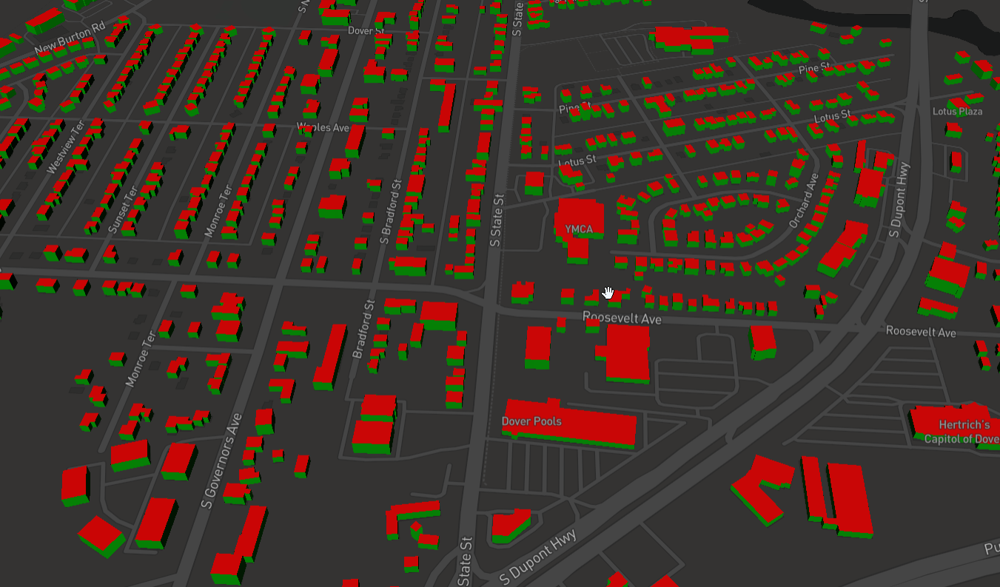

# Getting started

## Introduction

In this document we run pg2b3dm on a sample dataset, a shapefile from Delaware containing building footprints with a height attribute. 
The generated 3D tiles are visualized in a MapBox viewer.

## Download data

We download a dataset from the US Building Footprints.

https://wiki.openstreetmap.org/wiki/Microsoft_Building_Footprint_Data

Download dataset: 

Delaware - Dover (22,532 buildings available)

https://1drv.ms/u/s!AqWv0F0N63JkgQqO6E9e2kI28R16

Donwload zip, unzip. It contains a 'bldg_footprints.shp' shapefile with building height column.

## Setup PostGIS

1] Create Docker network

In this tutorial, we'll start 2 containers: PostGIS database and tiling tool pg2b3dm. Because those containers need to communicate
they must be in the same network. So we'll create a network first and add the 2 containers later.

If you have already installed a PostGIS server you can skip this step.

```
$ docker network create  mynetwork
```

2] Start PostGIS database

```
$ docker run -d --name some-postgis -e POSTGRES_PASSWORD=postgres -p 5432:5432 -it --network mynetwork mdillon/postgis
```

## Import buildings to PostGIS

Import the buildings to database using ogr2ogr.

```
$ ogr2ogr -f "PostgreSQL" PG:"host=localhost user=postgres password=postgres dbname=postgres" bldg_footprints.shp -nlt POLYGON -nln delaware_buildings
```

In PostGIS, a spatial table 'delaware_buildings' is created.

## PSQL into PostGIS

PSQL into PostGIS and do a count on the buildings:

```
$ psql -U postgres
Password for user postgres:
psql (11.5, server 11.2 (Debian 11.2-1.pgdg90+1))
WARNING: Console code page (850) differs from Windows code page (1252)
         8-bit characters might not work correctly. See psql reference
         page "Notes for Windows users" for details.
Type "help" for help.

postgres=# select count(*) from delaware_buildings;
 count
--------
 22532
(1 row)
```

## Clean data

Maybe there are some invalid polygons, let's remove them first.

```
postgres=# DELETE from delaware_buildings where ST_IsValid(wkb_geometry)=false;
DELETE 0
```

## Add id field with text type

```
postgres=# ALTER TABLE delaware_buildings ADD COLUMN id varchar;
postgres=# UPDATE delaware_buildings SET id = ogc_fid::text;
```

## Add column for output triangulated geometry

```
postgres=# ALTER TABLE delaware_buildings ADD COLUMN  geom_triangle geometry;
```

## Colors and styling

Add two more columns to the delaware_buildings table:

```
postgres=# ALTER TABLE delaware_buildings ADD COLUMN style json;
postgres=# ALTER TABLE delaware_buildings ADD COLUMN colors text[];
```

Update the style column with a JSON file containing walls, roof, floor colors:

```
postgres=# UPDATE delaware_buildings SET style = ('{ "walls": "#00ff00", "roof":" #ff0000", "floor":"#D3D3D3"}');
```
The 'colors' column will be filled in next 'bertt/tesselate_building' step.

now exit psql:

```
postgres=# exit
```

## Run bertt/tesselate_building

Run bertt/tesselate_building. It does the following:

- reads the footprint heights and geometries (from geom_3857);

- extrudes the buildings with height value; 

- triangulate the building and gets the colors per triangle;

- writes geometries to column geom_triangle (as polyhedralsurface geometries);

- writes colors info (color code per triangle) into colors column;

- format option -f mapbox/cesium: in the next sample the default output format is used: '-f mapbox'. 
When building for Cesium use '-f cesium'. 

```
$ docker run -it --network mynetwork bertt/tesselate_building -h some-postgis -U postgres -d postgres -f mapbox -t delaware_buildings -i wkb_geometry -o geom_triangle --idcolumn ogc_fid --stylecolumn style --colorscolumn colors
Tool: Tesselate buildings 1.0.0.0
Password for user postgres:
Progress: 100.00%
Elapsed: 74 seconds
Program finished.
```

## Run pg2b3dm

Run pg2b3dm, the program will make a connection to the database and 1 tileset.json and 927 b3dm's will be created in the output directory.

```
λ docker run -v $(pwd)/output:/app/output -it --network mynetwork geodan/pg2b3dm -h some-postgis -U postgres -c geom_triangle -t delaware_buildings -d postgres -i id -r colors
tool: pg2b3dm 0.8.0.0
Password for user postgres:
Start processing....
Calculating bounding boxes...
Writing tileset.json...
Writing 927 tiles...
Progress: tile 927 - 100.00%
Elapsed: 39 seconds
Program finished.
```

## Visualize in MapBox

Copy the generated tiles to sample_data\mapbox (overwrite the sample tiles there).

Put [sample_data/index_mapbox.html](sample_data/index_mapbox.html) on a webserver (for example https://caddyserver.com/).

Open a browser and if all goes well in Delaware - Dover you can find some 3D Tiles buildings.


